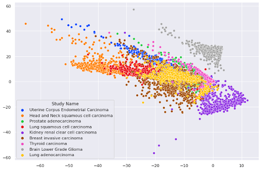

# Autoencoder to Better Visualize High-Dimensional Data

This project aims to demonstrate the ability of an autoencoder framework to learn an informative low-dimensional representation of a high-dimensional dataset and use this encoding to inform a visualization that (qualitatively) outperforms PCA. I chose a gene expression dataset with over 17,000 features (genes) and several thousand samples. My network included six hidden layers in the encoder and six in the decoder (the same layers but in reverse). After 500 epochs with a learning rate of 0.001, I was able to achieve a final loss of 0.4383, but the visualization was actually better after 150 epochs with a slightly higher loss (0.5124).

[Video (Google Drive link)](https://drive.google.com/file/d/1rFcZeKY-DyjDxb6kGA0lOw9SYwZhQQCr/view?usp=sharing)

## Problem Statement

Dimensionality reduction is a crucial step in the overall genome sequencing data analysis workflow. Common techniques include PCA, t-SNE, and UMAP, which are popular for their ability to produce two-dimensional representations that are easily visualizable. I was interested in seeing if an autoencoder architecture would be able to do a better job than PCA, specifically when applied to high-dimensional RNAseq data spanning across multiple cancer types.  

## Related Work

I took inspiration from:
- Chaudhary 2018: Deep Learning–Based Multi-Omics Integration Robustly Predicts Survival in Liver Cancer
- Tan 2015: UNSUPERVISED FEATURE CONSTRUCTION AND KNOWLEDGE EXTRACTION FROM GENOME-WIDE ASSAYS OF BREAST CANCER WITH DENOISING AUTOENCODERS
- Lin 2020: A deep adversarial variational autoencoder model for dimensionality reduction in single-cell RNA sequencing analysis

The Lin 2020 paper in particular is very thorough in its approach to benchmarking their proposed model against many others. I attempted a more simplified version that I felt comfortable with and applied it to a well-known public dataset (TCGA PanCan) that I was interested in.

The [TCGA Pan-Cancer Atlas RNASeq dataset](https://gdc.cancer.gov/about-data/publications/pancanatlas) includes expression values for 20,531 genes across 11,069 tumor samples. 33 cancer types are represented. I focused on the 9 cancer types which had 500 or more samples each. After some standard preprocessing, I was left with 5,726 samples and 17,475 genes.

| Type  |  No. samples |
|-------|--------------|
| BRCA  |  1215        |
| KIRC   |  606        |
| LUAD   |  576        |
| THCA   |  572        |
| HNSC   |  566        |
| UCEC  |   555        |
| LUSC  |   553        |
| PRAD  |   550        |
| LGG   |   533        |

## Methodology

I first applied standard PCA from sklearn to establish a baseline visualization. I applied k-means clustering with k=9 (1 for each cancer type) to the 2d representation to get a sense of which cancer types might accurately be captured by an unsupervised technique. 

I opted to utilize an autoencoder framework to achieve improvement over PCA. An autoencoder attempts to recreate the input it's given as accurately as possible after that input has been fed through any number of hidden layers that are successively more restrictive. The representation learned by the encoder portion can then be used for downstream purposes, like visualization (if the final number of features are 2 or 3).

Since the goal was to compare the two methods via a 2d visualization, the final layer of the encoder portion needed to have 2 neurons. With that in mind, I built backwards and successively increased the number of neurons in each layer until I reached something close to the input size. I attempted to achieve a systematic bottleneck over multiple layers rather than a rapid one that may have resulted in too much loss of information. A (crude) representation of the architecture is shown here (vertical rather than horizontal):

  

## Experiments/Evaluation

For autoencoder evaluation, I minimized MSELoss to achieve the most accurate reconstruction of the input.

Initially I had planned to use a mutual information based score (https://scikit-learn.org/stable/modules/clustering.html#mutual-information-based-scores) as an empirical way of determining whether PCA or the autoencoder resulted in a kmeans clustering that was closer to ground truth. However, I found that outside of maybe 1-3 clusters/cancer types, there was too much overlap between types to realistically match a predicted cluster to a ground truth cluster. A better solution may have been to calculate some kind of inter-cluster distance and see which technique maximed such a metric.

I settled on qualitatively (visually) assessing how well the two techniques ultimately separated the cancer types on the 2d plot. In this case it became clear when one outperformed the other, however a quantitative measure for emphasis would be good for the future, as mentioned.

## Results

The intial PCA representation left much to be desired. Only one of the nine cancer types clearly seperated out; the rest were jumbled together and hard to tell apart. The image on the left shows the PCA plot with ground truth labels. On the right is the same plot colored by k-means clustering with k=9 (for total number of cancer types). As can be seen, only the brain lower grade glioma (in gray) seems to be identified by the clustering algorithm.

  
   

The autoencoder framework improved steadily with more iterations, but at a certain point started to compress toward a point. I found the sweet spot in this case to be 150 epochs with a learning rate of 0.001. A sampling of other runs is shown in the table below and the corresponding loss graphs and visualizations are below as well.

| lr  |  n_epochs | final loss |
|-------|---------|-----|
| .001  |  20        | 0.7892 |
| .001   |  50        | 0.6562 |
| .001   |  150        | 0.5124 |
|.001 | 500 | 0.4383 |

20 epochs

  
   

50 epochs

  
   

150 epochs

  
  

The 150 epoch visualization ended up being the best of the bunch. K-means (k=9) applied to this encoding (below) yielded at least 3 cluters that matched closely with cancer types and possibly a fourth. It's also worth noting that two of the overlapping colors in the above plot (yellow and red) are both lung cancers and may be biologically/genetically similar; something the encoding may have baked in.

  

## Future Directions
- Quantitative measure of cancer type separation in 2d viz
- Comparison with other (nonlinear) dimensionality reduction techniques (t-SNE, UMAP)
- Networks other than autoencoders
